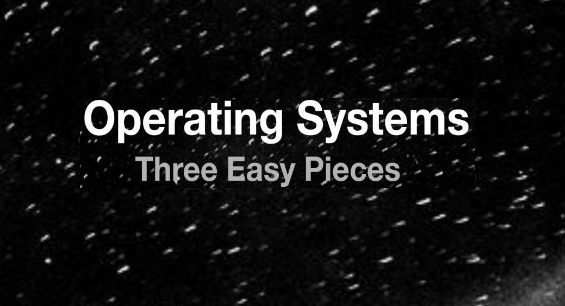

# 💾 OSTEP[Remzi] homework code 문제풀이  

  

### 교재 Operating Systems: Three Easy Pieces [Remzi] 속 Homework를 풀이합니다!  
\
예제 코드의 저작권은 모두 - [『Operating Systems: Three Easy Pieces』](https://pages.cs.wisc.edu/~remzi/OSTEP/) *-Remzi-* 에 있습니다.

형식은 MD이며, 조금더 원활한 화면을 보기위해서는 **개인 블로그 [https://yangdongs.web.app/](https://yangdongs.web.app/)을 추천드립니다.**

## 목록
[OS: Three Easy Pieces [Remzi] <5.Process API> 풀이](https://github.com/Yanghyeondong/OSTEP_hw_code/blob/main/os_hw_1.md)  
[OS: Three Easy Pieces [Remzi] <14.Debugging Memory> 풀이](https://github.com/Yanghyeondong/OSTEP_hw_code/blob/main/os_hw_2.md)  
[OS: Three Easy Pieces [Remzi] <19.TLB Measurement> 풀이](https://github.com/Yanghyeondong/OSTEP_hw_code/blob/main/os_hw_3.md)  
[OS: Three Easy Pieces [Remzi] <21.vmstat, 22.paging> 풀이](https://github.com/Yanghyeondong/OSTEP_hw_code/blob/main/os_hw_4.md)  
[OS: Three Easy Pieces [Remzi] <27.Debugging Race> 풀이](https://github.com/Yanghyeondong/OSTEP_hw_code/blob/main/os_hw_5.md)  
[OS: Three Easy Pieces [Remzi] <30.Condition Variables> 풀이](https://github.com/Yanghyeondong/OSTEP_hw_code/blob/main/os_hw_6.md)  
[OS: Three Easy Pieces [Remzi] <32.Deadlock> 풀이](https://github.com/Yanghyeondong/OSTEP_hw_code/blob/main/os_hw_7.md)  
[OS: Three Easy Pieces [Remzi] <39.FS APIs> 풀이](https://github.com/Yanghyeondong/OSTEP_hw_code/blob/main/os_hw_8.md)  
