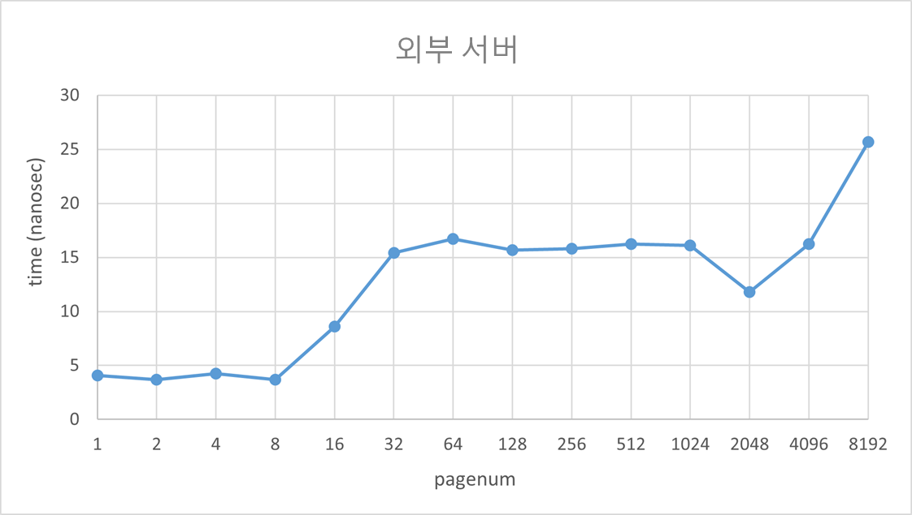
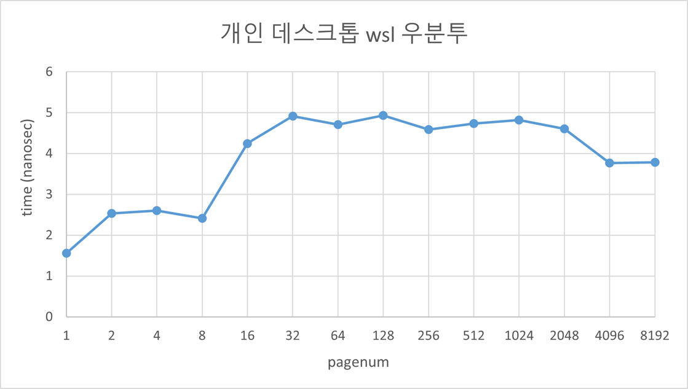

*해당 포스트는 필자가 직접 풀이한 것으로 오답이나 잘못된 해석이 있을 수도 있습니다.*  
*혹시나 지적할 부분이 있다면 항상 환영입니다!* 😏
## 문제 및 풀이

#### 1. For timing, you’ll need to use a timer (e.g., gettimeofday()). How precise is such a timer? How long does an operation have to take in order for you to time it precisely? (this will help determine how many times, in a loop, you’ll have to repeat a page access in order to time it successfully)
gettimeofday() 함수는 마이크로 초단위까지 시간을 잴 수 있다. 만약 이처럼 마이크로 초 단위를 사용할 경우, 나노 초 작업을 구별하기 위해서는 최소 1000번 정도 작업을 반복해야 한다. 이때, clock_gettime
`(clockid_t clk_id, struct timespec *tp)` 함수를 사용할 경우 나노 초까지 정밀한 시간을 얻을 수 있다.

```c
struct timespec {
        time_t   tv_sec;        /* seconds */
        long     tv_nsec;       /* nanoseconds */
};
```
(출처:https://linux.die.net/man/3/clock_gettime)
여기서 clk_id의 경우 CLOCK_REALTIME, CLOCK_MONOTONIC, CLOCK_PROCESS_CPUTIME_ID 등이 존재한다. 본 리포트에서는 그 중에서 "High-resolution per-process timer from the CPU"로 설명되어 있는 CLOCK_PROCESS_CPUTIME_ID를 사용한다.

#### 2. Write the program, called tlb.c, that can roughly measure the cost of accessing each page. Inputs to the program should be: the number of pages to touch and the number of trials.

```c
#include <stdio.h>
#include <stdlib.h>
#include <unistd.h>
#include <time.h>
#include <math.h>

int main(int argc, char *argv[]) {
  int n_pages = atoi(argv[1]);
  int n_trials = atoi(argv[2]);

  int pagesize = sysconf(_SC_PAGESIZE);
  // printf("page size: %d\n", pagesize);
  int *arr = calloc(n_pages, pagesize);
  struct timespec start, end;

  int jump = pagesize / sizeof(int);
  clock_gettime(CLOCK_PROCESS_CPUTIME_ID, &start);
  for (int i = 0; i < n_trials; i++) {
    for (int j = 0; j < n_pages * jump; j += jump)
      arr[j] += 1;
  }
  clock_gettime(CLOCK_PROCESS_CPUTIME_ID, &end);

  long timesum = (end.tv_sec - start.tv_sec) * pow(10, 9) + end.tv_nsec - start.tv_nsec;

  printf("%f\n",  (double)timesum / (n_trials * n_pages));
  free(arr);
  return 0;
}
```
위의 함수는 page의 개수와 trials의 횟수를 인자로 전달받으며, calloc을 통해 page 사이즈와 page 개수의 곱만큼 배열을 할당한다. 이후 중첩 반복문을 통해 배열에 접근하여 값을 수정한다. 최종적으로는 걸린 시간에 trials 와 page 수를 나누어 줌으로서 개별 접근 시간을 알 수 있다.

#### 3. Now write a script in your favorite scripting language (bash?) to run this program, while varying the number of pages accessed from 1 up to a few thousand, perhaps incrementing by a factor of two per iteration. Run the script on different machines and gather some data.

```c
#!/bin/sh
target="tlb.c"
output="./tlb"

gcc -g -o $output $target

for var in 1 2 4 8 16 32 64 128 256 512 1024 2048 4096 8192
do
    tlb ${var} 20000
done
```
외부 서버:

```c
2019312219@swji:~/hw/3$ test.sh
4.079250
3.695925
4.238037
3.679025
8.597144
15.431428
16.706047
15.680921
15.823412
16.253341
16.088938
11.811327
16.236492
25.697800
```
개인 데스크톱 wsl2 우분투:

```c
hdyang@DESKTOP-EU17S6T:~/os_hw3$ ./test.sh
1.555
2.5325
2.59875
2.41125
4.24625
4.912344
4.704766
4.933438
4.583887
4.734736
4.821323
4.603918
3.763282
3.787769
How many trials are needed to get reliable measurements?
```

20000회 정도로 trials를 설정하니 실행시마다 큰 기복 없이 잘 나타났다.

#### 4. Next, graph the results, making a graph that looks similar to the one above. Use a good tool like ploticus or even zplot. Visualization usually makes the data much easier to digest; why do you think that is?


그래프를 확인해 보면 외부 서버는 페이지의 넘버가 8을 넘어가는 구간부터 시간이 증가하는 모습을 보이며, 이후로는 다시 일정 시간을 유지하다가 8192가 되는 순간에 다시 시간이 증가하는 모습을 보인다. 첫번째 증가구간을 통해 first-level TLB 는 대략 8개 정도의 페이지를 담을 수 있는 것으로 예상되며, 두번째 증가구간을 통해 second-level TLB 까지 존재할 것으로 예측된다.
개인 데스크톱의 우분투의 경우 페이지의 넘버가 8을 넘어가는 구간부터 시간이 증가하는 모습을 보이며, 이후로는 다시 일정 시간을 유지하게 된다. 첫번째 증가구간을 통해 first-level TLB 는 대략 8개 정도의 페이지를 담을 수 있는 것으로 예상되며, second-level TLB의 경우 테스트하는 페이지의 수를 조금 더 늘려보아야지 그 유무와 크기를 알 수 있을 것 같다.
이처럼 그래프를 통해 시각화를 해보니 TLB의 실제 작동 과정을 쉽게 파악할 수 있었다.

#### 5. One thing to watch out for is compiler optimization. Compilers do all sorts of clever things, including removing loops which increment values that no other part of the program subsequently uses. How can you ensure the compiler does not remove the main loop above from your TLB size estimator?
이전 3번 문항 쉘 스크립트에서 알 수 있듯이, 본 리포트에서는 컴파일러로 gcc를 사용한다. gcc도 옵션을 통해 최적화를 지원하며, -O1, -O2, -O3 등 최적화 정도도 설정이 가능하다. 단, 이러한 옵션이 없는 경우 gcc는 -O0 로 설정되는데 이는 곧 기본적(디폴트 설정)으로 최적화를 하지 않는다는 의미이다. 따라서 이번 컴파일에서는 TLB size estimator 의 main loop 가 삭제되지 않았음을 예상할 수 있다.

#### 6. Another thing to watch out for is the fact that most systems today ship with multiple CPUs, and each CPU, of course, has its own TLB hierarchy. To really get good measurements, you have to run your code on just one CPU, instead of letting the scheduler bounce it from one CPU to the next. 
How can you do that? (hint: look up "pinning a thread" on Google for some clues)   
`pthread_setaffinity_np()` 와 같은 함수를 사용하면 CPU AFFINITY를 통해 프로세스가 지정해준 cpu만 사용하도록 할 수 있다.(출처:https://man7.org/linux/man pages/man3/pthread_setaffinity_np.3.html)  
What will happen if you don’t do this, and the code moves from one CPU to the other?    
만약 해당 코드가 cpu여러개로 바꾸어 가며 실행될 경우, TLB 데이터를 잃어버릴 수 있게 되며, 이때문에 접근 속도가 기존과 차이날 것이다.

#### 7. Another issue that might arise relates to initialization. If you don’t initialize the array a above before accessing it, the first time you access it will be very expensive, due to initial access costs such as demand zeroing. Will this affect your code and its timing? What can you do to counterbalance these potential costs?  
2번의 코드에서 만약 `calloc()` 대신 `malloc()`을 사용하여 초기화가 되지 않은 경우면, trial 값이 작을 때 ex.100 다음 결과와 같이 그 시간이 많이 달라진다. 이러한 일을 방지하기 위해서는 `calloc()`과 같이 처음부터 초기화를 해주는 함수를 사용하거나 `memset()` 함수를 통해 따로 초기화를 해주어야 한다.
calloc 사용

```c
2019312219@swji:~/hw/3$ test.sh
20.900000
11.915000
7.730000
5.923750
14.147500
14.945625
18.063437
15.753750
15.848750
15.969219
15.754199
11.706255
13.535962
19.845601
```
malloc 사용

```c
2019312219@swji:~/hw/3$ test.sh
19.460000
31.505000
30.497500
38.478750
47.331250
52.620312
48.623438
47.123125
52.791680
49.632383
49.840996
48.362427
47.301116
55.190599
```

## Source

- 『Operating Systems: Three Easy Pieces』 *-Remzi H. Arpaci-Dusseau 지음*  
  [https://pages.cs.wisc.edu/~remzi/OSTEP/](https://pages.cs.wisc.edu/~remzi/OSTEP/)