*해당 포스트는 필자가 직접 풀이한 것으로 오답이나 잘못된 해석이 있을 수도 있습니다.*  
*혹시나 지적할 부분이 있다면 항상 환영입니다!* 😏

*해당 포스트는 코드가 너무 길고 줄맞춤의 문제가 있어 사진으로 대체합니다* 😓

## 문제 및 풀이
#### 1. First, open two separate terminal connections to the same machine, so that you can easily run something in one window and the other. Now, in one window, run vmstat 1, which shows statistics about machine usage every second. Read the man page, the associated README, and any other information you need so that you can understand its output. Leave this window running vmstat for the rest of the exercises below. Now, we will run the program mem.c but with very little memory usage. This can be accomplished by typing ./mem 1 (which uses only 1 MB of memory). How do the CPU usage statistics change when running mem? Do the numbers in the user time column make sense?  How does this change when running more than one instance of mem at once?  
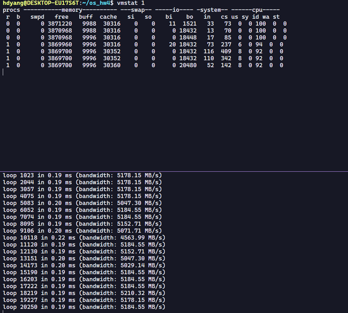
mem을 시작하자 cpu항목에서 idle이 감소하고 user time이 증가하는 모습을 보인다. 
만약에 mem을 하나 더 작동시키면 아래와 같이 user time이 약 2배가 되는 모습을 보인다.
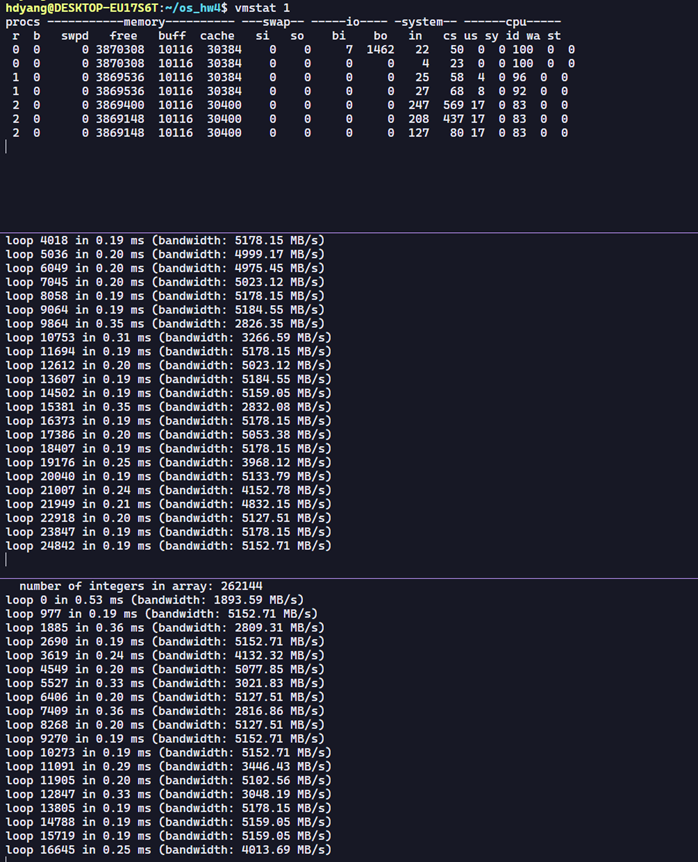

#### 2. Let’s now start looking at some of the memory statistics while running mem. We’ll focus on two columns: swpd (the amount of virtual memory used) and free (the amount of idle memory). Run ./mem 1024 (which allocates 1024 MB) and watch how these values change. Then kill the running program (by typing control-c) and watch again how the values change. What do you notice about the values? In particular, how does the free column change when the program exits? Does the amount of free memory increase by the expected amount when mem exits? 
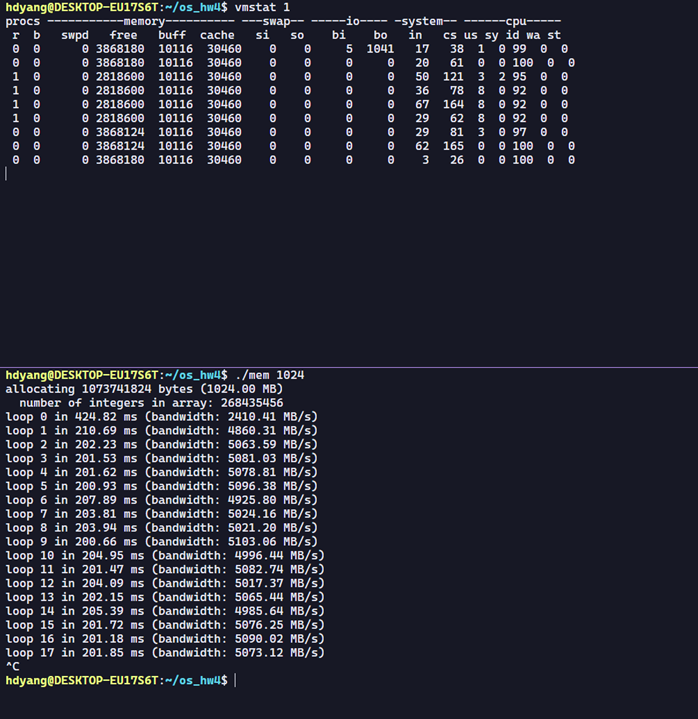
mem 1024가 실행되자 마자 free가 줄어드는 모습을 볼 수 있다. mem을 종료할 경우, free가 원래대로 돌아오는 모습을 볼 수 있다. 다만, 작은 일부는 조금 늦게 돌아오는 모습을 보인다.

#### 3. We’ll next look at the swap columns (si and so), which indicate how much swapping is taking place to and from the disk. Of course, to activate these, you’ll need to run mem with large amounts of memory. First, examine how much free memory is on your Linux system (for example, by typing cat /proc/meminfo; type man proc for details on the /proc file system and the types of information you can find there). One of the first entries in /proc/meminfo is the total amount of memory in your system. Let’s assume it’s something like 8 GB of memory; if so, start by running mem 4000 (about 4 GB) and watching the swap in/out columns. Do they ever give non-zero values? Then, try with 5000, 6000, etc. What happens to these values as the program enters the second loop (and beyond), as compared to the first loop? How much data (total) are swapped in and out during the second, third, and subsequent loops? (do the numbers make sense?) 
메모리는 4기가를 가지고 있다. 그래서 2048부터 시작하였다.
 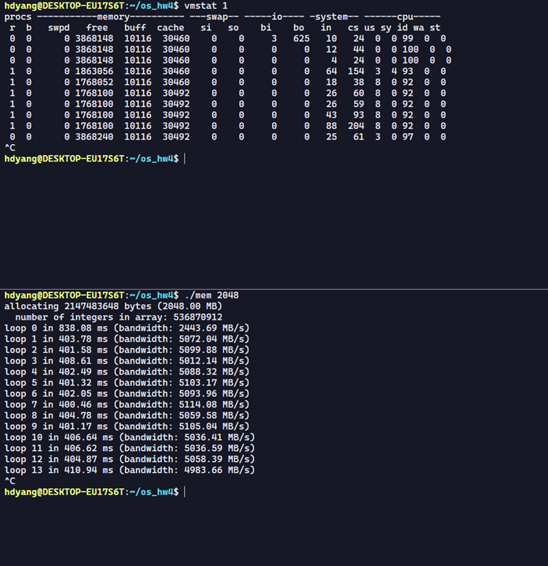
2048은 큰 변화가 없었다. swap in/out columns 이 여전히 0이여서 4096으로 시도했다.
 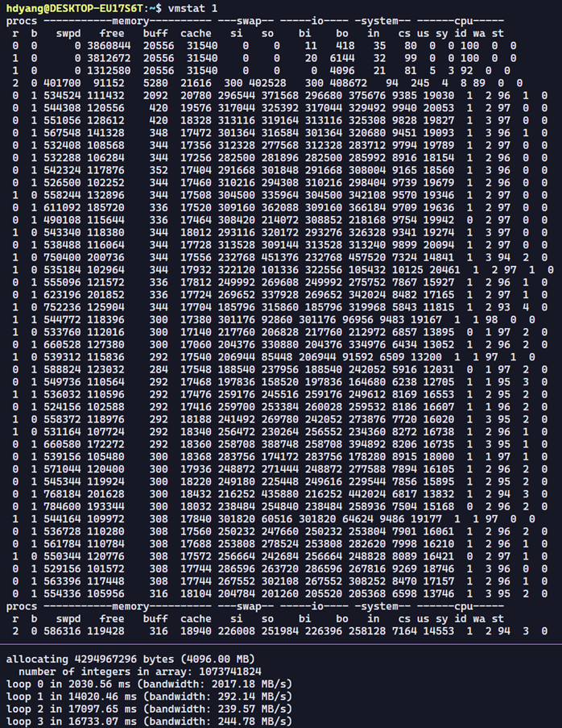
실험값이 4096이 되자  mem이 실행되고 초반에 swpd 값이 크게 올라간다. 여기서 first loop에서는 메모리 할당이 점점 증가하다가 일정 메모리를 가진 이후부터는 swpd가 약간의 변동은 있지만 더이상 크게 증가하지 않는 모습을 보여준다.

#### 4. Do the same experiments as above, but now watch the other statistics (such as CPU utilization, and block I/O statistics). How do they change when mem is running?
 
CPU utilization의 경우 user time이 증가했다가 다시 낮아진 상태로 유지되는 모습을 보인다. block I/O statistics의 경우, 초반에는 크게 증가했다가 이후로는 적당히 유지되는 모습을 보인다.
#### 5. Now let’s examine performance. Pick an input for mem that comfortably fits in memory (say 4000 if the amount of memory on the system is 8 GB).How long does loop 0 take (and subsequent loops 1, 2, etc.)?  Now pick a size comfortably beyond the size of memory (say 12000 again assuming 8 GB of memory). How long do the loops take here? How do the bandwidth numbers compare? How different is performance when constantly swapping versus fitting everything comfortably in memory? Can you make a graph, with the size of memory used by mem on the x-axis, and the bandwidth of accessing said memory on the y-axis? Finally, how does the performance of the first loop compare to that of subsequent loops, for both the case where everything fits in memory and where it doesn’t? 
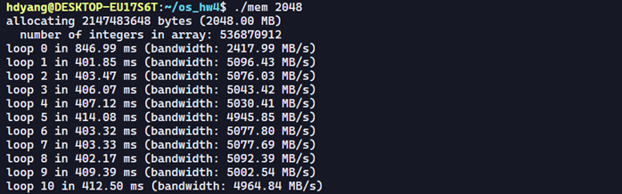
2048로 설정했을 때는 처음에는 846ms 에 2417MB/s가 나왔지만 이후로는 대부분 약400ms에 약5000MB/s가 나온다. 첫번째 loop의 경우 첫 할당이다 보니 느린 속도를 보여준다.
 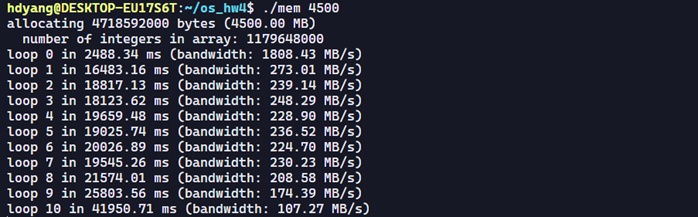
4500로 설정했을 때는 처음에는 2488ms에 1808MB/s가 나왔지만 이후로는 대부분 약20000ms에 약250MB/s가 나오며, 가면 갈수록 속도가 느려지는 모습으 보인다. 첫번째 loop의 경우 대부분 메모리에 할당이 되다 보니 빠른 속도를 보여준다. 나머지 루프는 확연히 느려지는 모습을 보인다.
스왑을 하지않고 메모리에 모든 데이터가 있는 경우가 훨씬 빠른 모습을 보인다.
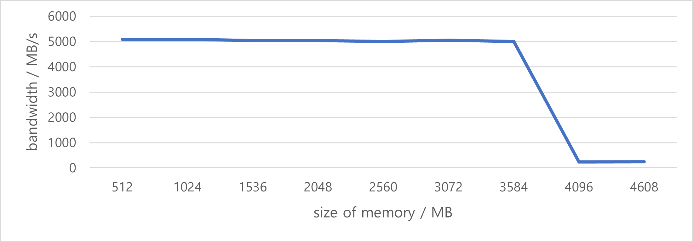

#### 6. Swap space isn’t infinite. You can use the tool swapon with the -s flag to see how much swap space is available. What happens if you try to run mem with increasingly large values, beyond what seems to be available in swap? At what point does the memory allocation fail?
 
약 1기가 정도 사용이 가능하다.
 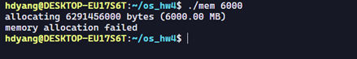
많이 사용하려 하면 에러가 발생한다. 전체 메모리 4기가 일때 5기가 전후로 더 이상 할당이 불가능한 실패가 발생한다.

#### 7. Finally, if you’re advanced, you can configure your system to use different swap devices using swapon and swapoff. Read the man pages for details. If you have access to different hardware, see how the performance of swapping changes when swapping to a classic hard drive, a flash-based SSD, and even a RAID array. How much can swapping performance be improved via newer devices? How close can you get to in-memory performance? 
본인이 테스트한 환경은 SSD 밖에 없어서 HDD와의 비교는 불가능 하지만, SSD가 기존 HDD보다는 5~6배 혹은 그 이상 빠르다는 점을 감안하면 스왑시 속도와 bandwidth 가 훨씬 더 우월하다는 점을 알 수있다. 다만, 이렇게 하더라도 메모리보다는 훨씬 느리다. 듀얼 채널로 구성된 본인의 메모리 대역폭은 5000 MB/s를 넘어가기 때문이다.

1. Generate random addresses with the following arguments: -s 0 -n 10, -s 1 -n 10, and -s 2 -n 10. Change the policy from FIFO, to LRU, to OPT. Compute whether each access in said address traces are hits or misses.
-s 0 -n 10 일때
  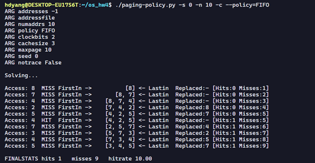
 
  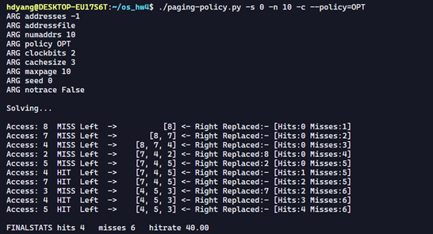
 

-s 1 -n 10 일때
  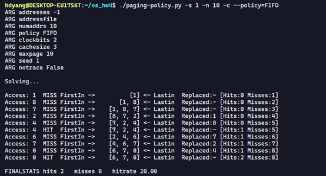
  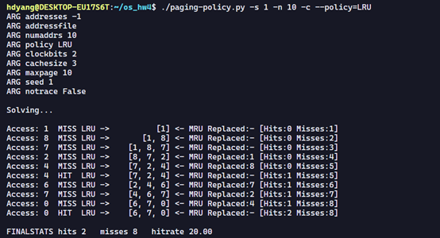
  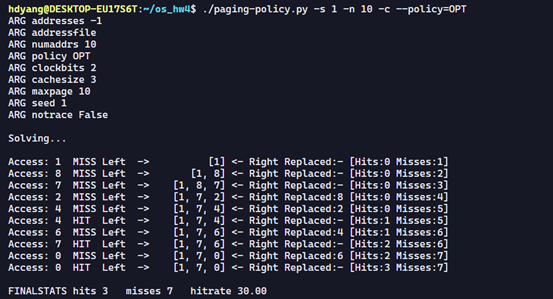

-s 2 -n 10 일때
 
 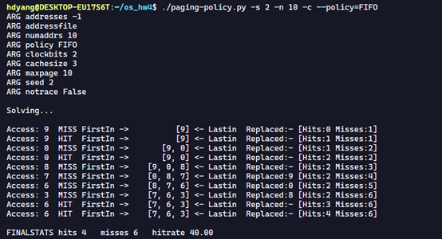 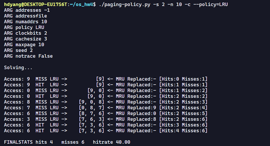 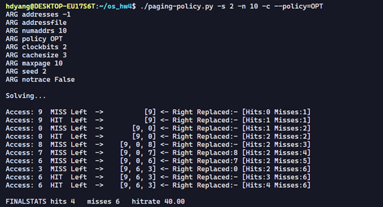

 
 
2. For a cache of size 5, generate worst-case address reference streams for each of the following policies: FIFO, LRU, and MRU (worst-case reference streams cause the most misses possible. For the worst case reference streams, how much bigger of a cache is needed to improve performance dramatically and approach OPT?
FIFO의 경우
 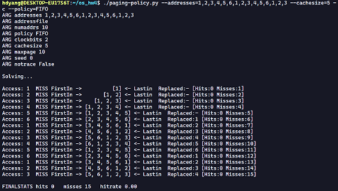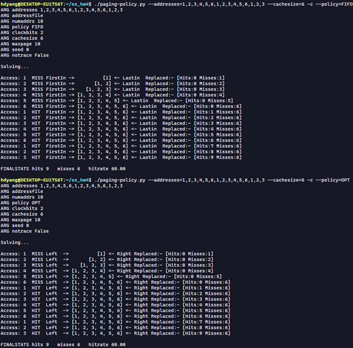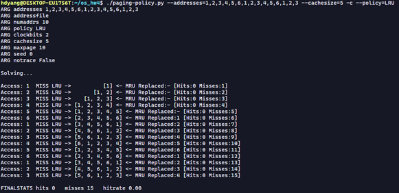
 
캐시 사이즈를 6으로 하니 OPT와 동일해진다.

LRU의 경우
 
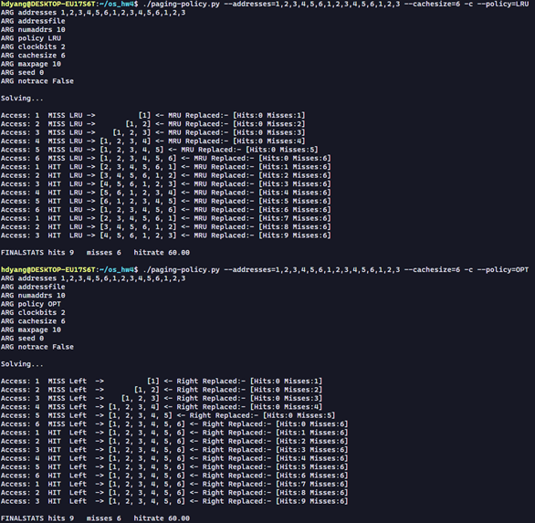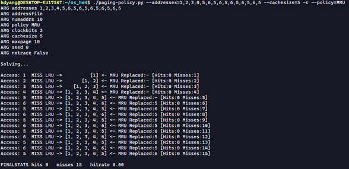

 
캐시 사이즈를 6으로 하니 OPT와 동일해진다.

MRU의 경우
 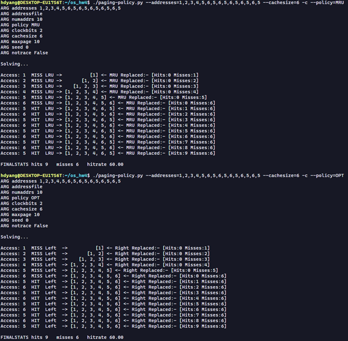

 
캐시 사이즈를 6으로 하니 OPT와 동일해진다.

3. Generate a random trace (use python or perl). How would you expect the different policies to perform on such a trace? 

랜덤 생성 코드:
 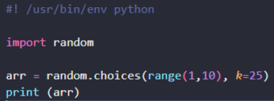  
 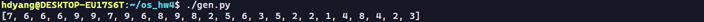
 

FIFO의 경우
 
LRU의 경우
 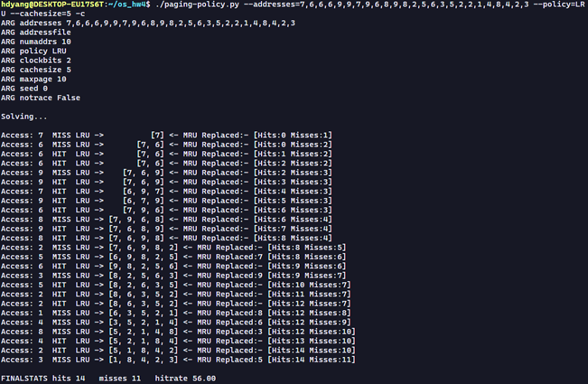

OPT의 경우
 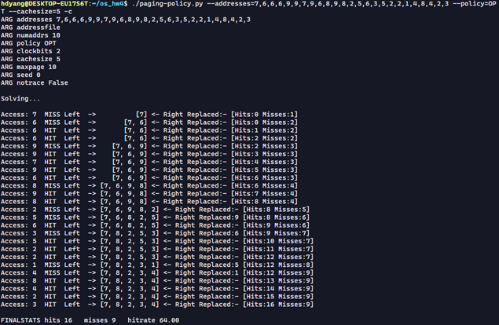
RAND의 경우
 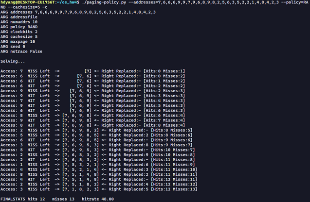

4. Now generate a trace with some locality. How can you generate such a trace? How does LRU perform on it? How much better than RAND is LRU? How does CLOCK do? How about CLOCK with different numbers of clock bits?

locality를 고려한 랜덤 코드 – 총 4개의 구간으로 나누어서 특정 범위만 반복되게 지역성을 주었다.

  
 

 

LRU의 경우
 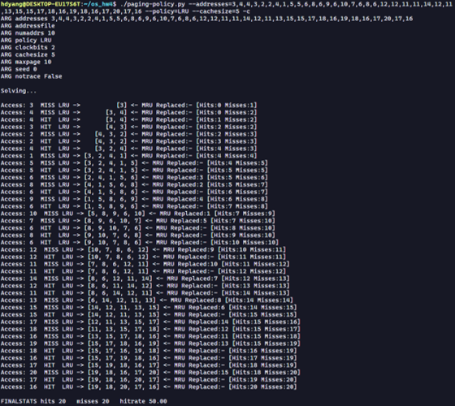

RAND의 경우
 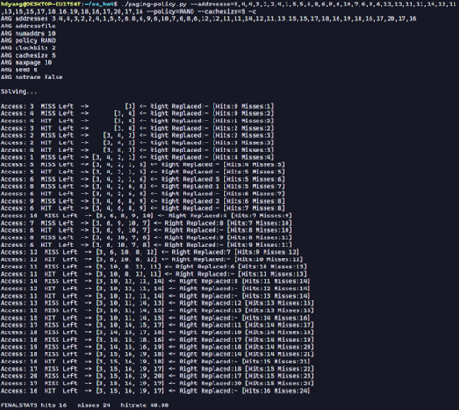

LRU가 조금 더 좋은 성능을 보여준다.
CLOCK의 경우 
 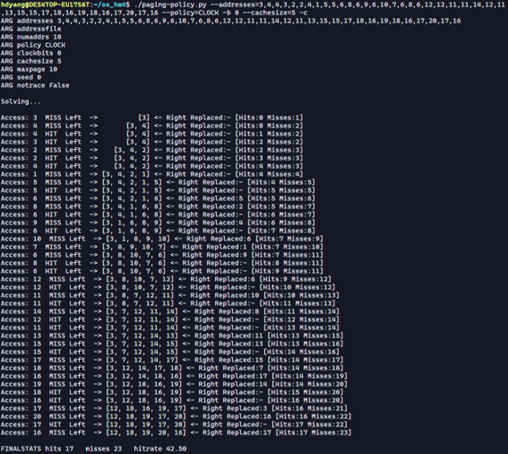
 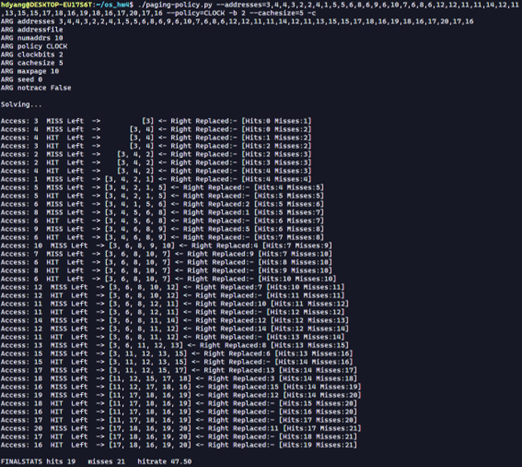
 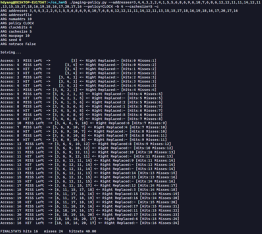
 
 
clock bits 0,2,4로 바꾸니 hit가 더 많아지기도 하고 적어지기도 한다.
5. Use a program like valgrind to instrument a real application and generate a virtual page reference stream. For example, running valgrind --tool=lackey --trace-mem=yes ls will output a nearly-complete reference trace of every instruction and data reference made by the program ls. To make this useful for the simulator above, you’ll have to first transform each virtual memory reference into a virtual page-number reference (done by masking off the offset and shifting the resulting bits downward). How big of a cache is needed for your application trace in order to satisfy a large fraction of requests? Plot a graph of its working set as the size of the cache increases.

마스킹에 사용한 코드 – 하위 12개 offset 비트 masking off the offset and shifting
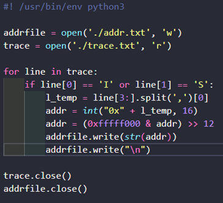
테스트에 사용한 bash 코드
 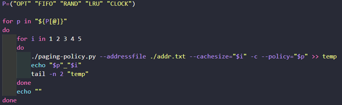

결과
 
 
Plot 결과
 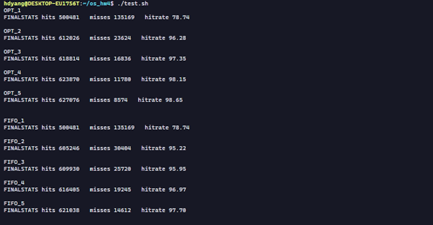
 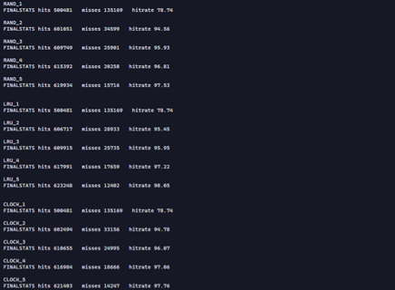

  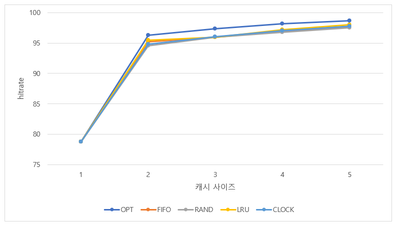
## Source

- 『Operating Systems: Three Easy Pieces』 *-Remzi H. Arpaci-Dusseau 지음*  
  [https://pages.cs.wisc.edu/~remzi/OSTEP/](https://pages.cs.wisc.edu/~remzi/OSTEP/)