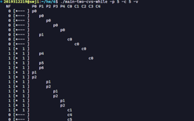
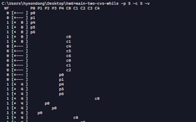

*해당 포스트는 필자가 직접 풀이한 것으로 오답이나 잘못된 해석이 있을 수도 있습니다.*  
*혹시나 지적할 부분이 있다면 항상 환영입니다!* 😏
## 문제 및 풀이

#### 1. Our first question focuses on main-two-cvs-while.c (the working solution). First, study the code. Do you think you have an understanding of what should happen when you run the program?
해당 프로그램은 `producer`와 `consumer`로 이루어진 여러 쓰레드를 생성하여 버퍼에 특정한 값을 채우고(`do_fill`) 읽는(`do_get`)과정을 반복하게 된다.  
`producer`의 경우, `mutex_lock` 사이의 섹션에 접근하면 (`num_full == max`) 일때 `Cond_wait(&empty, &m)`을 통해 버퍼가 빌때까지 기다리고, 버퍼가 비면(혹은 비어있었으면) `do_fill(base + i)`를 통해 채운다. 이후 `Cond_signal(&fill);`  을 통해 찼음을 다른 쓰레드에게 signal을 통해 알려준다.  
`consumer`의 경우, `mutex_lock` 사이의 섹션에 접근하면 (`num_full == 0`) 일때 `Cond_wait(&fill, &m);`을 통해 버퍼가 찰때까지 기다리고 , 버퍼가 차면(혹은 차있었으면) `do_get()`으로 가져온다. 이후 `Cond_signal(&empty);`  을 통해 비었음을 다른 쓰레드에게 signal을 통해 알려준다. `producer`가 모두 끝나면 버퍼를 `END_OF_STREAM`로 채우게 되고, 이를 본 consumer 도 끝나게 된다.

#### 2. Run with one producer and one consumer, and have the producer produce a few values. Start with a buffer (size 1), and then increase it. How does the behavior of the code change with larger buffers? (or does it?) What would you predict num full to be with differentbuffer sizes (e.g., -m 10) and different numbers of produced items (e.g., -l 100), when you change the consumer sleep string from default (no sleep) to -C 0,0,0,0,0,0,1?

```c
2019312219@swji:~/hw/6$ ./main-two-cvs-while -p 1 -c 1 -m 1 -v
 NF         P0 C0 
  0 [*--- ] p0
  0 [*--- ]    c0
  0 [*--- ] p1
  1 [*  0 ] p4
  1 [*  0 ] p5
  1 [*  0 ] p6
  1 [*  0 ]    c1
  0 [*--- ]    c4
  0 [*--- ]    c5
  0 [*--- ]    c6
  1 [*EOS ] [main: added end-of-stream marker]
  1 [*EOS ]    c0
  1 [*EOS ]    c1
  0 [*--- ]    c4
  0 [*--- ]    c5
  0 [*--- ]    c6
  
Consumer consumption:
  C0 -> 1
```


버퍼가 1인 경우, `use_ptr`(tracks where next consume should come from) 과 `fill_ptr`(tracks where next produce should go to)이 항상 동일하여 trace 상 버퍼가 항상 `*`로 표시되어 있었다.
버퍼가 여러개인 경우(증가할 경우) `producer` 가 버퍼에 한칸씩 쓰고 다음으로 포인터를 넘기고,  `consumer`도 한칸씩 읽으며 다음으로 포인터를 넘긴다. 따라서 처음에는 trace상 버퍼가 `*` 였다가 다음부터는 `fill_ptr`가 앞서고 `use_ptr`가 따라가는 모습을 보인다. 최종적으로는 다시 `*`가 된다. 단, 그 과정에서 버퍼를 읽고 쓰면서 한칸씩 전진했기에 원래 버퍼하고는 위치가 달라졌다. 코드의 실행 순서는 두 경우 모두 동일했다. `p0-c0-p1,4,5,6-c1,4,5,6-c0,1,4,5,6` 


 

```c
2019312219@swji:~/hw/6$ ./main-two-cvs-while -p 1 -c 1 -m 10 -v
 NF                                                      P0 C0 
  0 [*---  ---  ---  ---  ---  ---  ---  ---  ---  --- ] p0
  0 [*---  ---  ---  ---  ---  ---  ---  ---  ---  --- ]    c0
  0 [*---  ---  ---  ---  ---  ---  ---  ---  ---  --- ] p1
  1 [u  0 f---  ---  ---  ---  ---  ---  ---  ---  --- ] p4
  1 [u  0 f---  ---  ---  ---  ---  ---  ---  ---  --- ] p5
  1 [u  0 f---  ---  ---  ---  ---  ---  ---  ---  --- ] p6
  1 [u  0 f---  ---  ---  ---  ---  ---  ---  ---  --- ]    c1
  0 [ --- *---  ---  ---  ---  ---  ---  ---  ---  --- ]    c4
  0 [ --- *---  ---  ---  ---  ---  ---  ---  ---  --- ]    c5
  0 [ --- *---  ---  ---  ---  ---  ---  ---  ---  --- ]    c6
  1 [ --- uEOS f---  ---  ---  ---  ---  ---  ---  --- ] [main: added end-of-stream marker]
  1 [ --- uEOS f---  ---  ---  ---  ---  ---  ---  --- ]    c0
  1 [ --- uEOS f---  ---  ---  ---  ---  ---  ---  --- ]    c1
  0 [ ---  --- *---  ---  ---  ---  ---  ---  ---  --- ]    c4
  0 [ ---  --- *---  ---  ---  ---  ---  ---  ---  --- ]    c5
  0 [ ---  --- *---  ---  ---  ---  ---  ---  ---  --- ]    c6
```


```c
2019312219@swji:~/hw/6$ ./main-two-cvs-while -p 1 -c 1 -m 1 -l 100 -v
 NF         P0 C0 
  0 [*--- ] p0
  0 [*--- ]    c0
  0 [*--- ] p1
  1 [*  0 ] p4
  1 [*  0 ] p5
  1 [*  0 ] p6
  1 [*  0 ]    c1
  1 [*  0 ] p0
  0 [*--- ]    c4
  0 [*--- ]    c5
  0 [*--- ]    c6
  0 [*--- ] p1
  0 [*--- ]    c0
  1 [*  1 ] p4
  1 [*  1 ] p5
  1 [*  1 ] p6
  1 [*  1 ]    c1
  1 [*  1 ] p0
  0 [*--- ]    c4
  0 [*--- ]    c5
  0 [*--- ]    c6
  0 [*--- ] p1
  0 [*--- ]    c0
  1 [*  2 ] p4
  1 [*  2 ] p5
  1 [*  2 ] p6
  1 [*  2 ]    c1
  1 [*  2 ] p0
  0 [*--- ]    c4
  0 [*--- ]    c5
  0 [*--- ]    c6
  0 [*--- ] p1
  0 [*--- ]    c0
  1 [*  3 ] p4
  1 [*  3 ] p5
  1 [*  3 ] p6
  1 [*  3 ]    c1
  1 [*  3 ] p0

...생략

  0 [*--- ]    c4
  0 [*--- ]    c5
  0 [*--- ]    c6
  0 [*--- ] p1
  0 [*--- ]    c0
  1 [* 99 ] p4
  1 [* 99 ] p5
  1 [* 99 ] p6
  1 [* 99 ]    c1
  0 [*--- ]    c4
  0 [*--- ]    c5
  0 [*--- ]    c6
  1 [*EOS ] [main: added end-of-stream marker]
  1 [*EOS ]    c0
  1 [*EOS ]    c1
  0 [*--- ]    c4
  0 [*--- ]    c5
  0 [*--- ]    c6

Consumer consumption:
  C0 -> 100
```
`-m 10`인 경우, `-m 1` 과 비교했을때 num full값 자체나 순서가 달라진 점은 없었다. `-l 100` 인 경우, 값의 범위는 0,1 사이지만 값이 바뀌는 순서나 순간이 이전과 비교했을때 조금 달라졌다. p와 c가 실행되는 순서에 따라서 num full 값도 달라지는 모습을 보인다.
 

```c
2019312219@swji:~/hw/6$ ./main-two-cvs-while -p 1 -c 1 -m 1 -C 0,0,0,0,0,0,1 -v
 NF         P0 C0 
  0 [*--- ] p0
  0 [*--- ]    c0
  0 [*--- ] p1
  1 [*  0 ] p4
  1 [*  0 ] p5
  1 [*  0 ] p6
  1 [*  0 ]    c1
  0 [*--- ]    c4
  0 [*--- ]    c5
  0 [*--- ]    c6
  1 [*EOS ] [main: added end-of-stream marker]
  1 [*EOS ]    c0
  1 [*EOS ]    c1
  0 [*--- ]    c4
  0 [*--- ]    c5
  0 [*--- ]    c6

Consumer consumption:
C0 -> 1
```


```c
2019312219@swji:~/hw/6$ ./main-two-cvs-while -p 1 -c 1 -m 10 -C 0,0,0,0,0,0,1 -v
 NF                                                      P0 C0 
  0 [*---  ---  ---  ---  ---  ---  ---  ---  ---  --- ] p0
  0 [*---  ---  ---  ---  ---  ---  ---  ---  ---  --- ]    c0
  0 [*---  ---  ---  ---  ---  ---  ---  ---  ---  --- ] p1
  1 [u  0 f---  ---  ---  ---  ---  ---  ---  ---  --- ] p4
  1 [u  0 f---  ---  ---  ---  ---  ---  ---  ---  --- ] p5
  1 [u  0 f---  ---  ---  ---  ---  ---  ---  ---  --- ] p6
  1 [u  0 f---  ---  ---  ---  ---  ---  ---  ---  --- ]    c1
  0 [ --- *---  ---  ---  ---  ---  ---  ---  ---  --- ]    c4
  0 [ --- *---  ---  ---  ---  ---  ---  ---  ---  --- ]    c5
  0 [ --- *---  ---  ---  ---  ---  ---  ---  ---  --- ]    c6
  1 [ --- uEOS f---  ---  ---  ---  ---  ---  ---  --- ] [main: added end-of-stream marker]
  1 [ --- uEOS f---  ---  ---  ---  ---  ---  ---  --- ]    c0
  1 [ --- uEOS f---  ---  ---  ---  ---  ---  ---  --- ]    c1
  0 [ ---  --- *---  ---  ---  ---  ---  ---  ---  --- ]    c4
  0 [ ---  --- *---  ---  ---  ---  ---  ---  ---  --- ]    c5
  0 [ ---  --- *---  ---  ---  ---  ---  ---  ---  --- ]    c6

Consumer consumption:
  C0 -> 1
```

`-C 0,0,0,0,0,0,1` 을 적용했을때 `-m 1`, `-m 10`에 따른 num full값 차이는 크게 없었다.


```c
2019312219@swji:~/hw/6$ ./main-two-cvs-while -p 1 -c 1 -m 1 -l 100 -C 0,0,0,0,0,0,1 -v
 NF         P0 C0 
  0 [*--- ] p0
  0 [*--- ]    c0
  0 [*--- ] p1
  1 [*  0 ] p4
  1 [*  0 ] p5
  1 [*  0 ] p6
  1 [*  0 ]    c1
  1 [*  0 ] p0
  0 [*--- ]    c4
  0 [*--- ]    c5
  0 [*--- ]    c6
  0 [*--- ] p1
  1 [*  1 ] p4
  1 [*  1 ] p5
  1 [*  1 ] p6
  1 [*  1 ] p0
  1 [*  1 ] p1
  1 [*  1 ] p2
  1 [*  1 ]    c0
  1 [*  1 ]    c1
  0 [*--- ]    c4
  0 [*--- ]    c5
  0 [*--- ]    c6
  0 [*--- ] p3
  1 [*  2 ] p4
  1 [*  2 ] p5
  1 [*  2 ] p6
  1 [*  2 ] p0
  1 [*  2 ] p1
  1 [*  2 ] p2
  1 [*  2 ]    c0
  1 [*  2 ]    c1
  0 [*--- ]    c4
  0 [*--- ]    c5
  0 [*--- ]    c6
  0 [*--- ] p3
  1 [*  3 ] p4
  1 [*  3 ] p5
  1 [*  3 ] p6
  1 [*  3 ] p0
  1 [*  3 ] p1
  1 [*  3 ] p2
^C
```
`-C 0,0,0,0,0,0,1` 을 적용했을때, `-l 100`은 다른 양상을 보여준다. consumer sleep이 바뀜에 따라서 p와 c가 실행되는 순서가 달라지고, 이에 따라 num full도 달라지는 모습을 보인다.


#### 3. If possible, run the code on different systems (e.g., aMac and Linux). Do you see different behavior across these systems?
`./main-two-cvs-while -p 5 -c 5 -v`
위의 코드를 리눅스와 윈도우에서 실행시켜 보았을때, 다음과 같은 차이를 보였다.
   


#### 4. Let’s look at some timings. How long do you think the following execution, with one producer, three consumers, a single-entry shared buffer, and each consumer pausing at point c3 for a second, will take? ./main-two-cvs-while -p 1 -c 3 -m 1 -C 0,0,0,1,0,0,0:0,0,0,1,0,0,0:0,0,0,1,0,0,0 -l 10 -v -t


```c
2019312219@swji:~/hw/6$ ./main-two-cvs-while -p 1 -c 3 -m 1 -C 0,0,0,1,0,0,0:0,0,0,1,0,0,0:0,0,0,1,0,0,0 -l 10 -v -t
 NF         P0 C0 C1 C2 
  0 [*--- ] p0
  0 [*--- ]    c0
  0 [*--- ]          c0
  0 [*--- ]       c0
  0 [*--- ] p1
  1 [*  0 ] p4
  1 [*  0 ] p5
  1 [*  0 ] p6
  1 [*  0 ]    c1
  1 [*  0 ] p0
  0 [*--- ]    c4
  0 [*--- ]    c5
  0 [*--- ]    c6
  0 [*--- ]          c1
  0 [*--- ]    c0
  0 [*--- ]          c2
  0 [*--- ]       c1
  0 [*--- ]       c2
  0 [*--- ] p1
  1 [*  1 ] p4
  1 [*  1 ] p5
  1 [*  1 ] p6
  1 [*  1 ]    c1
  1 [*  1 ] p0
  0 [*--- ]    c4
  0 [*--- ]    c5
  0 [*--- ]    c6
  0 [*--- ]          c3
  0 [*--- ]    c0
  0 [*--- ]          c2
  0 [*--- ] p1
  1 [*  2 ] p4
  1 [*  2 ] p5
  1 [*  2 ] p6
  1 [*  2 ]    c1
  1 [*  2 ] p0
  0 [*--- ]    c4
  0 [*--- ]    c5
  0 [*--- ]    c6
  0 [*--- ]       c3
  0 [*--- ]    c0
  0 [*--- ]       c2
  0 [*--- ] p1
  1 [*  3 ] p4
  1 [*  3 ] p5
  1 [*  3 ] p6
  1 [*  3 ]    c1
  1 [*  3 ] p0
  0 [*--- ]    c4
  0 [*--- ]    c5
  0 [*--- ]    c6
  0 [*--- ]          c3
  0 [*--- ]    c0
  0 [*--- ]          c2
  0 [*--- ] p1
  1 [*  4 ] p4
  1 [*  4 ] p5
  1 [*  4 ] p6
  1 [*  4 ]    c1
  1 [*  4 ] p0
  0 [*--- ]    c4
  0 [*--- ]    c5
  0 [*--- ]    c6
  0 [*--- ]       c3
  0 [*--- ]    c0
  0 [*--- ]       c2
  0 [*--- ] p1
  1 [*  5 ] p4
  1 [*  5 ] p5
  1 [*  5 ] p6
  1 [*  5 ]    c1
  1 [*  5 ] p0
  0 [*--- ]    c4
  0 [*--- ]    c5
  0 [*--- ]    c6
  0 [*--- ]          c3
  0 [*--- ]    c0
  0 [*--- ]          c2
  0 [*--- ] p1
  1 [*  6 ] p4
  1 [*  6 ] p5
  1 [*  6 ] p6
  1 [*  6 ]    c1
  1 [*  6 ] p0
  0 [*--- ]    c4
  0 [*--- ]    c5
  0 [*--- ]    c6
  0 [*--- ]       c3
  0 [*--- ]    c0
  0 [*--- ]       c2
  0 [*--- ] p1
  1 [*  7 ] p4
  1 [*  7 ] p5
  1 [*  7 ] p6
  1 [*  7 ]    c1
  1 [*  7 ] p0
  0 [*--- ]    c4
  0 [*--- ]    c5
  0 [*--- ]    c6
  0 [*--- ]          c3
  0 [*--- ]    c0
  0 [*--- ]          c2
  0 [*--- ] p1
  1 [*  8 ] p4
  1 [*  8 ] p5
  1 [*  8 ] p6
  1 [*  8 ]    c1
  1 [*  8 ] p0
  0 [*--- ]    c4
  0 [*--- ]    c5
  0 [*--- ]    c6
  0 [*--- ]       c3
  0 [*--- ]    c0
  0 [*--- ]       c2
  0 [*--- ] p1
  1 [*  9 ] p4
  1 [*  9 ] p5
  1 [*  9 ] p6
  1 [*  9 ]    c1
  0 [*--- ]    c4
  0 [*--- ]    c5
  0 [*--- ]    c6
  0 [*--- ]          c3
  0 [*--- ]    c0
  0 [*--- ]          c2
  1 [*EOS ] [main: added end-of-stream marker]
  1 [*EOS ]    c1
  0 [*--- ]    c4
  0 [*--- ]    c5
  0 [*--- ]    c6
  0 [*--- ]       c3
  0 [*--- ]       c2
  1 [*EOS ] [main: added end-of-stream marker]
  1 [*EOS ]          c3
  0 [*--- ]          c4
  0 [*--- ]          c5
  0 [*--- ]          c6
  1 [*EOS ] [main: added end-of-stream marker]
  1 [*EOS ]       c3
  0 [*--- ]       c4
  0 [*--- ]       c5
  0 [*--- ]       c6

Consumer consumption:
  C0 -> 10
  C1 -> 0
  C2 -> 0

Total time: 12.01 seconds
```

총 12초가 소요되었다. `c3`은 `Cond_wait(&fill, &m);` 에 해당하는데, 현재 버퍼에 아무것도 없는 경우 `consumer`가 1초 sleep하게 된다. 이후 `consumer`는 스케줄링에 따라 다른 `consumer`로 리소스를 넘겨주게 된다. 각 실행마다 실제 스케줄링에 따라 결과가 달라질 수 있긴 하지만, 하나의 `consumer`가 이미 `get`을 하여서 다른 `consumer`가 한번씩 `sleep`하게 된다면(리소스를 놓아주지 않은채로) 전체 값 10개와 eos 를 고려했을때 대략 11~12초 정도가 사용되지 않았을까 예상한다.

#### 5. Now change the size of the shared buffer to 3 (-m 3). Will thismake any difference in the total time?


```c
2019312219@swji:~/hw/6$ ./main-two-cvs-while -p 1 -c 3 -m 1 -C 0,0,0,1,0,0,0:0,0,0,1,0,0,0:0,0,0,1,0,0,0 -l 10 -v -t
 NF         P0 C0 C1 C2 
  0 [*--- ] p0
  0 [*--- ]    c0
  0 [*--- ]          c0
  0 [*--- ]       c0
  0 [*--- ] p1
  1 [*  0 ] p4
  1 [*  0 ] p5
  1 [*  0 ] p6
  1 [*  0 ]    c1
  1 [*  0 ] p0
  0 [*--- ]    c4
  0 [*--- ]    c5
  0 [*--- ]    c6
  0 [*--- ]          c1
  0 [*--- ]    c0
  0 [*--- ]          c2
  0 [*--- ]       c1
  0 [*--- ]       c2
  0 [*--- ] p1
  1 [*  1 ] p4
  1 [*  1 ] p5
  1 [*  1 ] p6
  1 [*  1 ]    c1
  1 [*  1 ] p0
  0 [*--- ]    c4
  0 [*--- ]    c5
  0 [*--- ]    c6
  0 [*--- ]          c3
  0 [*--- ]    c0
  0 [*--- ]          c2
  0 [*--- ] p1
  1 [*  2 ] p4
  1 [*  2 ] p5
  1 [*  2 ] p6
  1 [*  2 ]    c1
  1 [*  2 ] p0
  0 [*--- ]    c4
  0 [*--- ]    c5
  0 [*--- ]    c6
  0 [*--- ]       c3
  0 [*--- ]    c0
  0 [*--- ]       c2
  0 [*--- ] p1
  1 [*  3 ] p4
  1 [*  3 ] p5
  1 [*  3 ] p6
  1 [*  3 ]    c1
  1 [*  3 ] p0
  0 [*--- ]    c4
  0 [*--- ]    c5
  0 [*--- ]    c6
  0 [*--- ]          c3
  0 [*--- ]    c0
  0 [*--- ]          c2
  0 [*--- ] p1
  1 [*  4 ] p4
  1 [*  4 ] p5
  1 [*  4 ] p6
  1 [*  4 ]    c1
  1 [*  4 ] p0
  0 [*--- ]    c4
  0 [*--- ]    c5
  0 [*--- ]    c6
  0 [*--- ]       c3
  0 [*--- ]    c0
  0 [*--- ]       c2
  0 [*--- ] p1
  1 [*  5 ] p4
  1 [*  5 ] p5
  1 [*  5 ] p6
  1 [*  5 ]    c1
  1 [*  5 ] p0
  0 [*--- ]    c4
  0 [*--- ]    c5
  0 [*--- ]    c6
  0 [*--- ]          c3
  0 [*--- ]    c0
  0 [*--- ]          c2
  0 [*--- ] p1
  1 [*  6 ] p4
  1 [*  6 ] p5
  1 [*  6 ] p6
  1 [*  6 ]    c1
  1 [*  6 ] p0
  0 [*--- ]    c4
  0 [*--- ]    c5
  0 [*--- ]    c6
  0 [*--- ]       c3
  0 [*--- ]    c0
  0 [*--- ]       c2
  0 [*--- ] p1
  1 [*  7 ] p4
  1 [*  7 ] p5
  1 [*  7 ] p6
  1 [*  7 ]    c1
  1 [*  7 ] p0
  0 [*--- ]    c4
  0 [*--- ]    c5
  0 [*--- ]    c6
  0 [*--- ]          c3
  0 [*--- ]    c0
  0 [*--- ]          c2
  0 [*--- ] p1
  1 [*  8 ] p4
  1 [*  8 ] p5
  1 [*  8 ] p6
  1 [*  8 ]    c1
  1 [*  8 ] p0
  0 [*--- ]    c4
  0 [*--- ]    c5
  0 [*--- ]    c6
  0 [*--- ]       c3
  0 [*--- ]    c0
  0 [*--- ]       c2
  0 [*--- ] p1
  1 [*  9 ] p4
  1 [*  9 ] p5
  1 [*  9 ] p6
  1 [*  9 ]    c1
  0 [*--- ]    c4
  0 [*--- ]    c5
  0 [*--- ]    c6
  0 [*--- ]          c3
  0 [*--- ]    c0
  0 [*--- ]          c2
  1 [*EOS ] [main: added end-of-stream marker]
  1 [*EOS ]    c1
  0 [*--- ]    c4
  0 [*--- ]    c5
  0 [*--- ]    c6
  0 [*--- ]       c3
  0 [*--- ]       c2
  1 [*EOS ] [main: added end-of-stream marker]
  1 [*EOS ]          c3
  0 [*--- ]          c4
  0 [*--- ]          c5
  0 [*--- ]          c6
  1 [*EOS ] [main: added end-of-stream marker]
  1 [*EOS ]       c3
  0 [*--- ]       c4
  0 [*--- ]       c5
  0 [*--- ]       c6

Consumer consumption:
  C0 -> 10
  C1 -> 0
  C2 -> 0

Total time: 12.01 seconds
```

```c
2019312219@swji:~/hw/6$ ./main-two-cvs-while -p 1 -c 3 -m 3 -C 0,0,0,1,0,0,0:0,0,0,1,0,0,0:0,0,0,1,0,0,0 
-l 10 -v -t
 NF                   P0 C0 C1 C2 
  0 [*---  ---  --- ] p0
  0 [*---  ---  --- ]    c0
  0 [*---  ---  --- ]       c0
  0 [*---  ---  --- ] p1
  0 [*---  ---  --- ]          c0
  1 [u  0 f---  --- ] p4
  1 [u  0 f---  --- ] p5
  1 [u  0 f---  --- ] p6
  1 [u  0 f---  --- ]    c1
  1 [u  0 f---  --- ] p0
  0 [ --- *---  --- ]    c4
  0 [ --- *---  --- ]    c5
  0 [ --- *---  --- ]    c6
  0 [ --- *---  --- ]       c1
  0 [ --- *---  --- ]    c0
  0 [ --- *---  --- ]       c2
  0 [ --- *---  --- ]          c1
  0 [ --- *---  --- ]          c2
  0 [ --- *---  --- ] p1
  1 [ --- u  1 f--- ] p4
  1 [ --- u  1 f--- ] p5
  1 [ --- u  1 f--- ] p6
  1 [ --- u  1 f--- ]    c1
  1 [ --- u  1 f--- ] p0
  0 [ ---  --- *--- ]    c4
  0 [ ---  --- *--- ]    c5
  0 [ ---  --- *--- ]    c6
  0 [ ---  --- *--- ]       c3
  0 [ ---  --- *--- ]    c0
  0 [ ---  --- *--- ]       c2
  0 [ ---  --- *--- ] p1
  1 [f---  --- u  2 ] p4
  1 [f---  --- u  2 ] p5
  1 [f---  --- u  2 ] p6
  1 [f---  --- u  2 ]    c1
  1 [f---  --- u  2 ] p0
  0 [*---  ---  --- ]    c4
  0 [*---  ---  --- ]    c5
  0 [*---  ---  --- ]    c6
  0 [*---  ---  --- ]          c3
  0 [*---  ---  --- ]    c0
  0 [*---  ---  --- ]          c2
  0 [*---  ---  --- ] p1
  1 [u  3 f---  --- ] p4
  1 [u  3 f---  --- ] p5
  1 [u  3 f---  --- ] p6
  1 [u  3 f---  --- ]    c1
  1 [u  3 f---  --- ] p0
  0 [ --- *---  --- ]    c4
  0 [ --- *---  --- ]    c5
  0 [ --- *---  --- ]    c6
  0 [ --- *---  --- ]       c3
  0 [ --- *---  --- ]    c0
  0 [ --- *---  --- ]       c2
  0 [ --- *---  --- ] p1
  1 [ --- u  4 f--- ] p4
  1 [ --- u  4 f--- ] p5
  1 [ --- u  4 f--- ] p6
  1 [ --- u  4 f--- ]    c1
  1 [ --- u  4 f--- ] p0
  0 [ ---  --- *--- ]    c4
  0 [ ---  --- *--- ]    c5
  0 [ ---  --- *--- ]    c6
  0 [ ---  --- *--- ]          c3
  0 [ ---  --- *--- ]    c0
  0 [ ---  --- *--- ]          c2
  0 [ ---  --- *--- ] p1
  1 [f---  --- u  5 ] p4
  1 [f---  --- u  5 ] p5
  1 [f---  --- u  5 ] p6
  1 [f---  --- u  5 ]    c1
  1 [f---  --- u  5 ] p0
  0 [*---  ---  --- ]    c4
  0 [*---  ---  --- ]    c5
  0 [*---  ---  --- ]    c6
  0 [*---  ---  --- ]       c3
  0 [*---  ---  --- ]    c0
  0 [*---  ---  --- ]       c2
  0 [*---  ---  --- ] p1
  1 [u  6 f---  --- ] p4
  1 [u  6 f---  --- ] p5
  1 [u  6 f---  --- ] p6
  1 [u  6 f---  --- ]    c1
  1 [u  6 f---  --- ] p0
  0 [ --- *---  --- ]    c4
  0 [ --- *---  --- ]    c5
  0 [ --- *---  --- ]    c6
  0 [ --- *---  --- ]          c3
  0 [ --- *---  --- ]    c0
  0 [ --- *---  --- ]          c2
  0 [ --- *---  --- ] p1
  1 [ --- u  7 f--- ] p4
  1 [ --- u  7 f--- ] p5
  1 [ --- u  7 f--- ] p6
  1 [ --- u  7 f--- ]    c1
  1 [ --- u  7 f--- ] p0
  0 [ ---  --- *--- ]    c4
  0 [ ---  --- *--- ]    c5
  0 [ ---  --- *--- ]    c6
  0 [ ---  --- *--- ]       c3
  0 [ ---  --- *--- ]    c0
  0 [ ---  --- *--- ]       c2
  0 [ ---  --- *--- ] p1
  1 [f---  --- u  8 ] p4
  1 [f---  --- u  8 ] p5
  1 [f---  --- u  8 ] p6
  1 [f---  --- u  8 ]    c1
  1 [f---  --- u  8 ] p0
  0 [*---  ---  --- ]    c4
  0 [*---  ---  --- ]    c5
  0 [*---  ---  --- ]    c6
  0 [*---  ---  --- ]          c3
  0 [*---  ---  --- ]    c0
  0 [*---  ---  --- ]          c2
  0 [*---  ---  --- ] p1
  1 [u  9 f---  --- ] p4
  1 [u  9 f---  --- ] p5
  1 [u  9 f---  --- ] p6
  1 [u  9 f---  --- ]    c1
  0 [ --- *---  --- ]    c4
  0 [ --- *---  --- ]    c5
  0 [ --- *---  --- ]    c6
  0 [ --- *---  --- ]       c3
  0 [ --- *---  --- ]    c0
  0 [ --- *---  --- ]       c2
  1 [ --- uEOS f--- ] [main: added end-of-stream marker]
  2 [f--- uEOS  EOS ] [main: added end-of-stream marker]
  3 [ EOS *EOS  EOS ] [main: added end-of-stream marker]
  3 [ EOS *EOS  EOS ]          c3
  2 [ EOS f--- uEOS ]          c4
  2 [ EOS f--- uEOS ]          c5
  2 [ EOS f--- uEOS ]          c6
  2 [ EOS f--- uEOS ]       c3
  1 [uEOS f---  --- ]       c4
  1 [uEOS f---  --- ]       c5
  1 [uEOS f---  --- ]       c6
  1 [uEOS f---  --- ]    c1
  0 [ --- *---  --- ]    c4
  0 [ --- *---  --- ]    c5
  0 [ --- *---  --- ]    c6

Consumer consumption:
  C0 -> 10
  C1 -> 0
  C2 -> 0

Total time: 11.01 seconds
```

버퍼의 개수가 3개로 늘었을 경우에도, 이전과 비슷하게 11초가 걸렸다.

#### 6. Now change the location of the sleep to c6 (this models a consumer taking something off the queue and then doing something with it), again using a single-entry buffer. What time do you predict in this case? ./main-two-cvs-while -p 1 -c 3 -m 1 -C 0,0,0,0,0,0,1:0,0,0,0,0,0,1:0,0,0,0,0,0,1 -l 10 -v -t


```c
2019312219@swji:~/hw/6$ ./main-two-cvs-while -p 1 -c 3 -m 1 -C 0,0,0,0,0,0,1:0,0,0,0,0,0,1:0,0,0,0,0,0,1 -l 10 -v -t
 NF         P0 C0 C1 C2 
  0 [*--- ] p0
  0 [*--- ]    c0
  0 [*--- ]       c0
  0 [*--- ] p1
  0 [*--- ]          c0
  1 [*  0 ] p4
  1 [*  0 ] p5
  1 [*  0 ] p6
  1 [*  0 ]    c1
  1 [*  0 ] p0
  0 [*--- ]    c4
  0 [*--- ]    c5
  0 [*--- ]    c6
  0 [*--- ]       c1
  0 [*--- ]       c2
  0 [*--- ]          c1
  0 [*--- ]          c2
  0 [*--- ] p1
  1 [*  1 ] p4
  1 [*  1 ] p5
  1 [*  1 ] p6
  1 [*  1 ]       c3
  1 [*  1 ] p0
  0 [*--- ]       c4
  0 [*--- ]       c5
  0 [*--- ]       c6
  0 [*--- ] p1
  1 [*  2 ] p4
  1 [*  2 ] p5
  1 [*  2 ] p6
  1 [*  2 ]          c3
  1 [*  2 ] p0
  0 [*--- ]          c4
  0 [*--- ]          c5
  0 [*--- ]          c6
  0 [*--- ] p1
  1 [*  3 ] p4
  1 [*  3 ] p5
  1 [*  3 ] p6
  1 [*  3 ] p0
  1 [*  3 ] p1
  1 [*  3 ] p2
  1 [*  3 ]    c0
  1 [*  3 ]    c1
  0 [*--- ]    c4
  0 [*--- ]    c5
  0 [*--- ]    c6
  0 [*--- ] p3
  1 [*  4 ] p4
  1 [*  4 ] p5
  1 [*  4 ] p6
  1 [*  4 ] p0
  1 [*  4 ] p1
  1 [*  4 ] p2
  1 [*  4 ]       c0
  1 [*  4 ]       c1
  0 [*--- ]       c4
  0 [*--- ]       c5
  0 [*--- ]       c6
  0 [*--- ] p3
  1 [*  5 ] p4
  1 [*  5 ]          c0
  1 [*  5 ] p5
  1 [*  5 ] p6
  1 [*  5 ]          c1
  1 [*  5 ] p0
  0 [*--- ]          c4
  0 [*--- ]          c5
  0 [*--- ]          c6
  0 [*--- ] p1
  1 [*  6 ] p4
  1 [*  6 ] p5
  1 [*  6 ] p6
  1 [*  6 ] p0
  1 [*  6 ] p1
  1 [*  6 ] p2
  1 [*  6 ]    c0
  1 [*  6 ]    c1
  0 [*--- ]    c4
  0 [*--- ]    c5
  0 [*--- ]    c6
  0 [*--- ] p3
  1 [*  7 ] p4
  1 [*  7 ] p5
  1 [*  7 ] p6
  1 [*  7 ] p0
  1 [*  7 ] p1
  1 [*  7 ] p2
  1 [*  7 ]       c0
  1 [*  7 ]       c1
  0 [*--- ]       c4
  0 [*--- ]       c5
  0 [*--- ]       c6
  0 [*--- ] p3
  1 [*  8 ] p4
  1 [*  8 ] p5
  1 [*  8 ]          c0
  1 [*  8 ] p6
  1 [*  8 ]          c1
  1 [*  8 ] p0
  0 [*--- ]          c4
  0 [*--- ]          c5
  0 [*--- ]          c6
  0 [*--- ] p1
  1 [*  9 ] p4
  1 [*  9 ] p5
  1 [*  9 ] p6
  1 [*  9 ]    c0
  1 [*  9 ]    c1
  0 [*--- ]    c4
  0 [*--- ]    c5
  0 [*--- ]    c6
  1 [*EOS ] [main: added end-of-stream marker]
  1 [*EOS ]       c0
  1 [*EOS ]       c1
  0 [*--- ]       c4
  0 [*--- ]       c5
  0 [*--- ]       c6
  1 [*EOS ] [main: added end-of-stream marker]
  1 [*EOS ]          c0
  1 [*EOS ]          c1
  0 [*--- ]          c4
  0 [*--- ]          c5
  0 [*--- ]          c6
  1 [*EOS ] [main: added end-of-stream marker]
  1 [*EOS ]    c0
  1 [*EOS ]    c1
  0 [*--- ]    c4
  0 [*--- ]    c5
  0 [*--- ]    c6

Consumer consumption:
  C0 -> 4
  C1 -> 3
  C2 -> 3

Total time: 5.00 seconds
```

이번에는 sleep 시점이 `c6`  `Mutex_unlock(&m);` 임을 고려하면 저번과는 다르게 리소스를 풀어주고 lock을 하게된다. 따라서 기존과 같이 11~12초를 허비하지 않고, 그사이에 다른 consumer들이 producer의 값을 받다보니 5초밖에 걸리지 않았다.

#### 7. Finally, change the buffer size to 3 again (-m 3). What time do you predict now?


```c
2019312219@swji:~/hw/6$ ./main-two-cvs-while -p 1 -c 3 -m 3 -C 0,0,0,0,0,0,1:0,0,0,0,0,0,1:0,0,0,0,0,0,1 
-l 10 -v -t
 NF                   P0 C0 C1 C2 
  0 [*---  ---  --- ] p0
  0 [*---  ---  --- ]    c0
  0 [*---  ---  --- ]       c0
  0 [*---  ---  --- ] p1
  0 [*---  ---  --- ]          c0
  1 [u  0 f---  --- ] p4
  1 [u  0 f---  --- ] p5
  1 [u  0 f---  --- ] p6
  1 [u  0 f---  --- ]    c1
  1 [u  0 f---  --- ] p0
  0 [ --- *---  --- ]    c4
  0 [ --- *---  --- ]    c5
  0 [ --- *---  --- ]    c6
  0 [ --- *---  --- ]       c1
  0 [ --- *---  --- ]       c2
  0 [ --- *---  --- ]          c1
  0 [ --- *---  --- ]          c2
  0 [ --- *---  --- ] p1
  1 [ --- u  1 f--- ] p4
  1 [ --- u  1 f--- ] p5
  1 [ --- u  1 f--- ] p6
  1 [ --- u  1 f--- ]       c3
  1 [ --- u  1 f--- ] p0
  0 [ ---  --- *--- ]       c4
  0 [ ---  --- *--- ]       c5
  0 [ ---  --- *--- ]       c6
  0 [ ---  --- *--- ] p1
  1 [f---  --- u  2 ] p4
  1 [f---  --- u  2 ] p5
  1 [f---  --- u  2 ] p6
  1 [f---  --- u  2 ]          c3
  1 [f---  --- u  2 ] p0
  0 [*---  ---  --- ]          c4
  0 [*---  ---  --- ]          c5
  0 [*---  ---  --- ]          c6
  0 [*---  ---  --- ] p1
  1 [u  3 f---  --- ] p4
  1 [u  3 f---  --- ] p5
  1 [u  3 f---  --- ] p6
  1 [u  3 f---  --- ] p0
  1 [u  3 f---  --- ] p1
  2 [u  3    4 f--- ] p4
  2 [u  3    4 f--- ] p5
  2 [u  3    4 f--- ] p6
  2 [u  3    4 f--- ] p0
  2 [u  3    4 f--- ] p1
  3 [*  3    4    5 ] p4
  3 [*  3    4    5 ] p5
  3 [*  3    4    5 ] p6
  3 [*  3    4    5 ] p0
  3 [*  3    4    5 ] p1
  3 [*  3    4    5 ] p2
  3 [*  3    4    5 ]    c0
  3 [*  3    4    5 ]    c1
  2 [f--- u  4    5 ]    c4
  2 [f--- u  4    5 ]    c5
  2 [f--- u  4    5 ]    c6
  2 [f--- u  4    5 ] p3
  3 [   6 *  4    5 ] p4
  3 [   6 *  4    5 ] p5
  3 [   6 *  4    5 ] p6
  3 [   6 *  4    5 ] p0
  3 [   6 *  4    5 ] p1
  3 [   6 *  4    5 ] p2
  3 [   6 *  4    5 ]       c0
  3 [   6 *  4    5 ]       c1
  2 [   6 f--- u  5 ]       c4
  2 [   6 f--- u  5 ]       c5
  2 [   6 f--- u  5 ]       c6
  2 [   6 f--- u  5 ] p3
  3 [   6    7 *  5 ] p4
  3 [   6    7 *  5 ] p5
  3 [   6    7 *  5 ]          c0
  3 [   6    7 *  5 ] p6
  3 [   6    7 *  5 ]          c1
  3 [   6    7 *  5 ] p0
  2 [u  6    7 f--- ]          c4
  2 [u  6    7 f--- ]          c5
  2 [u  6    7 f--- ]          c6
  2 [u  6    7 f--- ] p1
  3 [*  6    7    8 ] p4
  3 [*  6    7    8 ] p5
  3 [*  6    7    8 ] p6
  3 [*  6    7    8 ] p0
  3 [*  6    7    8 ] p1
  3 [*  6    7    8 ] p2
  3 [*  6    7    8 ]    c0
  3 [*  6    7    8 ]    c1
  2 [f--- u  7    8 ]    c4
  2 [f--- u  7    8 ]    c5
  2 [f--- u  7    8 ]    c6
  2 [f--- u  7    8 ] p3
  3 [   9 *  7    8 ] p4
  3 [   9 *  7    8 ] p5
  3 [   9 *  7    8 ] p6
  3 [   9 *  7    8 ]       c0
  3 [   9 *  7    8 ]       c1
  2 [   9 f--- u  8 ]       c4
  2 [   9 f--- u  8 ]       c5
  2 [   9 f--- u  8 ]       c6
  3 [   9  EOS *  8 ] [main: added end-of-stream marker]
  3 [   9  EOS *  8 ]          c0
  3 [   9  EOS *  8 ]          c1
  2 [u  9  EOS f--- ]          c4
  2 [u  9  EOS f--- ]          c5
  2 [u  9  EOS f--- ]          c6
  3 [*  9  EOS  EOS ] [main: added end-of-stream marker]
  3 [*  9  EOS  EOS ]    c0
  3 [*  9  EOS  EOS ]    c1
  2 [f--- uEOS  EOS ]    c4
  2 [f--- uEOS  EOS ]    c5
  2 [f--- uEOS  EOS ]    c6
  3 [ EOS *EOS  EOS ] [main: added end-of-stream marker]
  3 [ EOS *EOS  EOS ]       c0
  3 [ EOS *EOS  EOS ]       c1
  2 [ EOS f--- uEOS ]       c4
  2 [ EOS f--- uEOS ]       c5
  2 [ EOS f--- uEOS ]       c6
  2 [ EOS f--- uEOS ]          c0
  2 [ EOS f--- uEOS ]          c1
  1 [uEOS f---  --- ]          c4
  1 [uEOS f---  --- ]          c5
  1 [uEOS f---  --- ]          c6
  1 [uEOS f---  --- ]    c0
  1 [uEOS f---  --- ]    c1
  0 [ --- *---  --- ]    c4
  0 [ --- *---  --- ]    c5
  0 [ --- *---  --- ]    c6

Consumer consumption:
  C0 -> 4
  C1 -> 3
  C2 -> 3

Total time: 5.00 seconds
```

버퍼 크기가 3일때도 동일하게 5초가 소요되었다.

#### 8. Now let’s look at main-one-cv-while.c. Can you configure a sleep string, assuming a single producer, one consumer, and a buffer of size 1, to cause a problem with this code?
하나의 `producer`와 하나의`consumer`, 버퍼사이즈 1만으로는 문제를 발생시킬 수가 없다고 생각했다. 여러 `consumer`(혹은 `producer`) 쓰레드가 실행되야지 서로의 동시성 문제가 발생되기 때문이다.

#### 9. Now change the number of consumers to two. Can you construct sleep strings for the producer and the consumers so as to cause a problem in the code? 

```c
2019312219@swji:~/hw/6$ ./main-one-cv-while -c 2 -v -P 0,0,0,0,0,0,1
 NF         P0 C0 C1 
  0 [*--- ] p0
  0 [*--- ]    c0
  0 [*--- ]       c0
  0 [*--- ] p1
  1 [*  0 ] p4
  1 [*  0 ] p5
  1 [*  0 ] p6
  1 [*  0 ]    c1
  0 [*--- ]    c4
  0 [*--- ]    c5
  0 [*--- ]    c6
  0 [*--- ]       c1
  0 [*--- ]    c0
  0 [*--- ]       c2
  0 [*--- ]    c1
  0 [*--- ]    c2
  1 [*EOS ] [main: added end-of-stream marker]
  1 [*EOS ]       c3
  0 [*--- ]       c4
  0 [*--- ]       c5
  0 [*--- ]       c6
  0 [*--- ]    c3
  0 [*--- ]    c2
^C


```
`./main-one-cv-while -c 2 -v -P 0,0,0,0,0,0,1`
위의 코드를 실행할 경우 2개의 쓰레드가 계속 sleep하게 되는 문제가 발생한다.

#### 10. Now examine main-two-cvs-if.c. Can you cause a problem to happen in this code? Again consider the case where there is only one consumer, and then the case where there is more than one.
consumer가 2명 이상일 경우에는 다음과 같은 상황이 가능하다. consumer1가 버퍼가 비어있어 wait를 하고있는 중이고, producer가 차있다는 시그널을 보낸 경우를 생각해보자. 이때 consumer1이 wait에서 깨어나서 락을 풀고 get하기 전에 consumer2 가 먼저 스케줄링되어 존재하는 버퍼에서 get을 할 경우, consumer1이 시그널을 받고 깨어나더라도 그때는 버퍼에 get할 것이 남아있지 않다. 이때 문제가 발생할 수 있다.
#### 11. Finally, examine main-two-cvs-while-extra-unlock.c. What problem arises when you release the lock before doing a put or a get? Can you reliably cause such a problem to happen, given the sleep strings? What bad thing can happen?
put이나 get 전에 lock을 풀게되면 다른 쓰레드에서 도중에 리소스를 가져가게 되는 문제가 발생한다. lock이 잠시 풀리는 부분에 해당하는 `tmp = do_get(); c4;` 에 sleep strings 을 1로 주면 다음과 같이 된다. 단, 비교를 위해 두개의 consumer중 하나에만 적용.

```c
2019312219@swji:~/hw/6$ ./main-two-cvs-while-extra-unlock -p 1 -c 2 -m 5 1 -l 10 -v -C 0,0,0,0,1,0,0:0,0,
0,0,0,0,0
 NF                             P0 C0 C1 
  0 [*---  ---  ---  ---  --- ] p0
  0 [*---  ---  ---  ---  --- ]    c0
  0 [*---  ---  ---  ---  --- ]       c0
  0 [*---  ---  ---  ---  --- ] p1
  1 [u  0 f---  ---  ---  --- ] p4
  1 [u  0 f---  ---  ---  --- ]    c1
  0 [ --- *---  ---  ---  --- ]    c4
  0 [ --- *---  ---  ---  --- ]       c1
  0 [ --- *---  ---  ---  --- ]       c2
  0 [ --- *---  ---  ---  --- ] p5
  0 [ --- *---  ---  ---  --- ] p6
  0 [ --- *---  ---  ---  --- ]       c3
  0 [ --- *---  ---  ---  --- ] p0
  0 [ --- *---  ---  ---  --- ]       c2
  0 [ --- *---  ---  ---  --- ] p1
  1 [ --- u  1 f---  ---  --- ] p4
  1 [ --- u  1 f---  ---  --- ] p5
  1 [ --- u  1 f---  ---  --- ] p6
  1 [ --- u  1 f---  ---  --- ]       c3
  1 [ --- u  1 f---  ---  --- ] p0
  0 [ ---  --- *---  ---  --- ]       c4
  0 [ ---  --- *---  ---  --- ] p1
  1 [ ---  --- u  2 f---  --- ] p4
  1 [ ---  --- u  2 f---  --- ]       c5
  1 [ ---  --- u  2 f---  --- ]       c6
  1 [ ---  --- u  2 f---  --- ] p5
  1 [ ---  --- u  2 f---  --- ]       c0
  1 [ ---  --- u  2 f---  --- ] p6
  1 [ ---  --- u  2 f---  --- ]       c1
  1 [ ---  --- u  2 f---  --- ] p0
  0 [ ---  ---  --- *---  --- ]       c4
  0 [ ---  ---  --- *---  --- ] p1
  1 [ ---  ---  --- u  3 f--- ] p4
  1 [ ---  ---  --- u  3 f--- ]       c5
  1 [ ---  ---  --- u  3 f--- ]       c6
  1 [ ---  ---  --- u  3 f--- ] p5
  1 [ ---  ---  --- u  3 f--- ]       c0
  1 [ ---  ---  --- u  3 f--- ] p6
  1 [ ---  ---  --- u  3 f--- ]       c1
  1 [ ---  ---  --- u  3 f--- ] p0
  0 [ ---  ---  ---  --- *--- ]       c4
  0 [ ---  ---  ---  --- *--- ] p1
  1 [f---  ---  ---  --- u  4 ] p4
  1 [f---  ---  ---  --- u  4 ]       c5
  1 [f---  ---  ---  --- u  4 ]       c6
  1 [f---  ---  ---  --- u  4 ] p5
  1 [f---  ---  ---  --- u  4 ]       c0
  1 [f---  ---  ---  --- u  4 ] p6
  1 [f---  ---  ---  --- u  4 ]       c1
  1 [f---  ---  ---  --- u  4 ] p0
  0 [*---  ---  ---  ---  --- ]       c4
  0 [*---  ---  ---  ---  --- ] p1
  1 [u  5 f---  ---  ---  --- ] p4
  1 [u  5 f---  ---  ---  --- ]       c5
  1 [u  5 f---  ---  ---  --- ]       c6
  1 [u  5 f---  ---  ---  --- ] p5
  1 [u  5 f---  ---  ---  --- ]       c0
  1 [u  5 f---  ---  ---  --- ] p6
  1 [u  5 f---  ---  ---  --- ]       c1
  1 [u  5 f---  ---  ---  --- ] p0
  0 [ --- *---  ---  ---  --- ]       c4
  0 [ --- *---  ---  ---  --- ] p1
  1 [ --- u  6 f---  ---  --- ] p4
  1 [ --- u  6 f---  ---  --- ]       c5
  1 [ --- u  6 f---  ---  --- ]       c6
  1 [ --- u  6 f---  ---  --- ] p5
  1 [ --- u  6 f---  ---  --- ]       c0
  1 [ --- u  6 f---  ---  --- ] p6
  1 [ --- u  6 f---  ---  --- ]       c1
  1 [ --- u  6 f---  ---  --- ] p0
  0 [ ---  --- *---  ---  --- ]       c4
  0 [ ---  --- *---  ---  --- ] p1
  1 [ ---  --- u  7 f---  --- ] p4
  1 [ ---  --- u  7 f---  --- ]       c5
  1 [ ---  --- u  7 f---  --- ]       c6
  1 [ ---  --- u  7 f---  --- ] p5
  1 [ ---  --- u  7 f---  --- ]       c0
  1 [ ---  --- u  7 f---  --- ] p6
  1 [ ---  --- u  7 f---  --- ]       c1
  1 [ ---  --- u  7 f---  --- ] p0
  0 [ ---  ---  --- *---  --- ]       c4
  0 [ ---  ---  --- *---  --- ] p1
  1 [ ---  ---  --- u  8 f--- ] p4
  1 [ ---  ---  --- u  8 f--- ]       c5
  1 [ ---  ---  --- u  8 f--- ]       c6
  1 [ ---  ---  --- u  8 f--- ] p5
  1 [ ---  ---  --- u  8 f--- ]       c0
  1 [ ---  ---  --- u  8 f--- ] p6
  1 [ ---  ---  --- u  8 f--- ]       c1
  1 [ ---  ---  --- u  8 f--- ] p0
  0 [ ---  ---  ---  --- *--- ]       c4
  0 [ ---  ---  ---  --- *--- ] p1
  1 [f---  ---  ---  --- u  9 ] p4
  1 [f---  ---  ---  --- u  9 ]       c5
  1 [f---  ---  ---  --- u  9 ]       c6
  1 [f---  ---  ---  --- u  9 ] p5
  1 [f---  ---  ---  --- u  9 ]       c0
  1 [f---  ---  ---  --- u  9 ] p6
  1 [f---  ---  ---  --- u  9 ]       c1
  0 [*---  ---  ---  ---  --- ]       c4
  1 [uEOS f---  ---  ---  --- ] [main: added end-of-stream marker]
  2 [uEOS  EOS f---  ---  --- ] [main: added end-of-stream marker]
  2 [uEOS  EOS f---  ---  --- ]       c5
  2 [uEOS  EOS f---  ---  --- ]       c6
  2 [uEOS  EOS f---  ---  --- ]       c0
  2 [uEOS  EOS f---  ---  --- ]       c1
  1 [ --- uEOS f---  ---  --- ]       c4
  1 [ --- uEOS f---  ---  --- ]       c5
  1 [ --- uEOS f---  ---  --- ]       c6
  1 [ --- uEOS f---  ---  --- ]    c5
  1 [ --- uEOS f---  ---  --- ]    c6
  1 [ --- uEOS f---  ---  --- ]    c0
  1 [ --- uEOS f---  ---  --- ]    c1
  0 [ ---  --- *---  ---  --- ]    c4
  0 [ ---  --- *---  ---  --- ]    c5
  0 [ ---  --- *---  ---  --- ]    c6

Consumer consumption:
  C0 -> 1
  C1 -> 9
```
consumer1에서 c4에 잠시 lock이 풀린사이(sleep strings영향) 다른 쓰레드가 실행되어 이후로도 consumer1이 계속 할당되지 못하는 모습을 보여준다.

## Source

- 『Operating Systems: Three Easy Pieces』 *-Remzi H. Arpaci-Dusseau 지음*  
  [https://pages.cs.wisc.edu/~remzi/OSTEP/](https://pages.cs.wisc.edu/~remzi/OSTEP/)